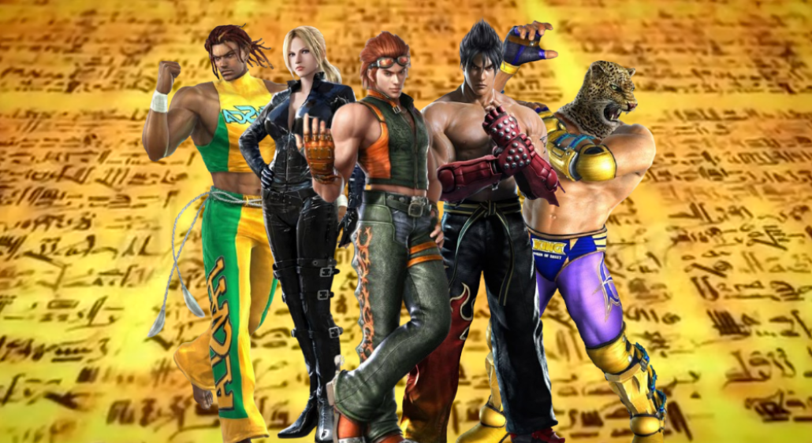
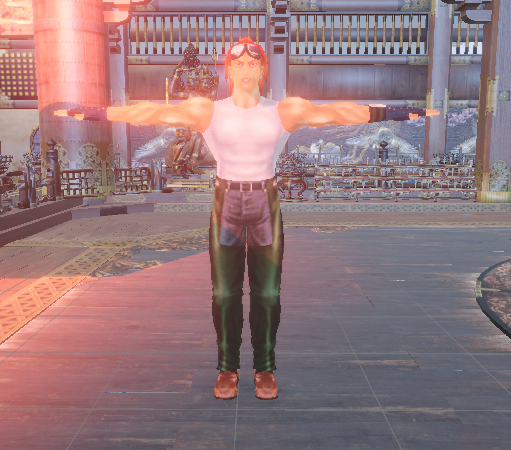
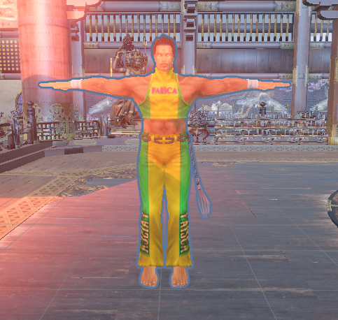
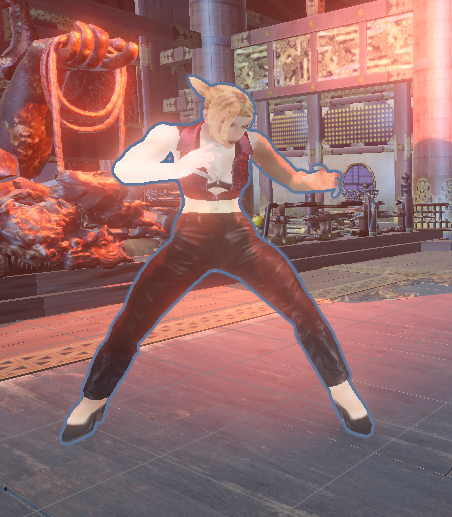
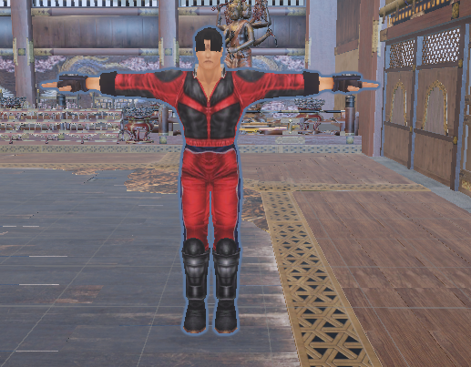
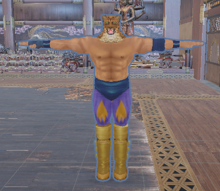
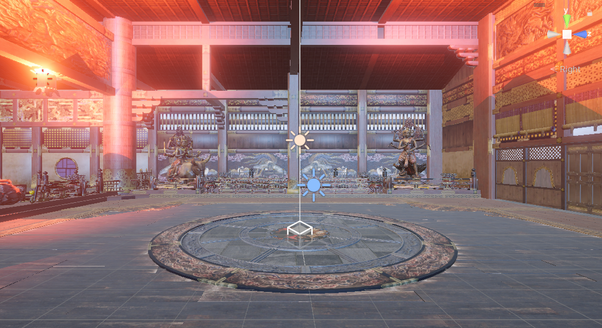
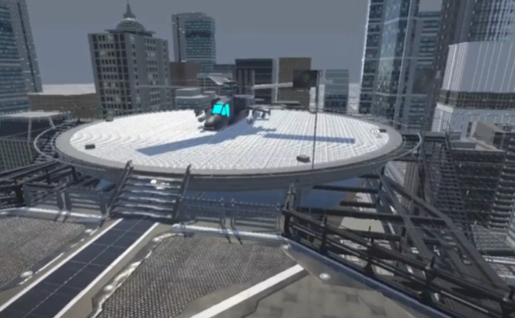
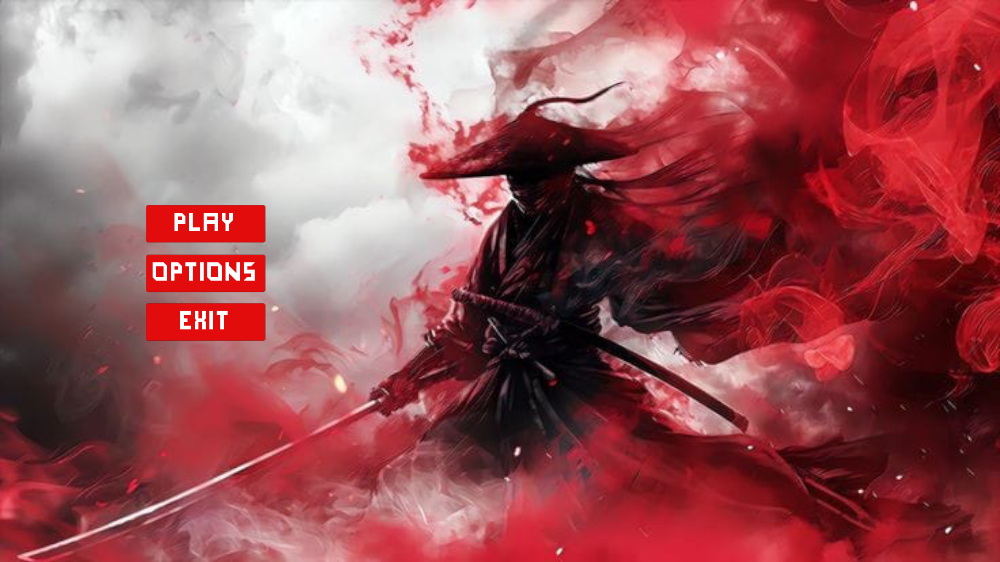

# 🥷 The Warriors of the Hidden Scroll: **PENTARA**
> *"The scroll was never meant to be read again..."*

## 🧧 Game Description

Centuries ago, five warriors trained under the same master — a legendary swordsage who guarded a hidden scroll: **The Art of the Universe**, a technique said to grant the power to rewrite fate through combat.

The master, aware of the scroll’s catastrophic potential, embedded its secrets within the bodies of his five disciples — not in writing, but in muscle memory and scars. Each warrior carried a fragment of the truth, never to reunite again.

But betrayal struck.  
Two of them — now **opponent samurai** — seek to **recreate the technique** and **ascend beyond mortality**. To do that, they must defeat the remaining three and extract the fragments from their souls — through battle.

The last three warriors do not fight for glory.  
They fight to protect the legacy...  
...and to ensure the scroll is never read again.


---

## 🎮 Gameplay Features

- 🎭 **Five Unique Warriors** — Each with distinct combat styles, hidden pasts, and special techniques.
- ⚔️ **Epic 1v1 Battles** — Skill-based combat with scroll-powered special attacks.
- 🗺️ **Dynamic Arenas** — Environments affect gameplay and reveal lore through interaction.
- 🎨 **Stylized Visuals** — Inspired by classic ink-wash art and modern action aesthetics.
- 🔊 **Immersive Soundtracks** — Traditional instruments blended with cinematic scores.
- 📜 **Story-Driven Combat** — Unfold character arcs through in-game events and battles.

---

## 🧙‍♂️ Characters




---
## 🗡️ Opponents



---

## 🏯 Arenas



---

## 🌐 Landing Page


---

## 📦 Installation / How to Play
```bash
# Clone this repo
git clone https://github.com/vanisha-github/Pentara.git
cd Pentara

# Download Unity supporting version: Unity 2022.2.21f1
